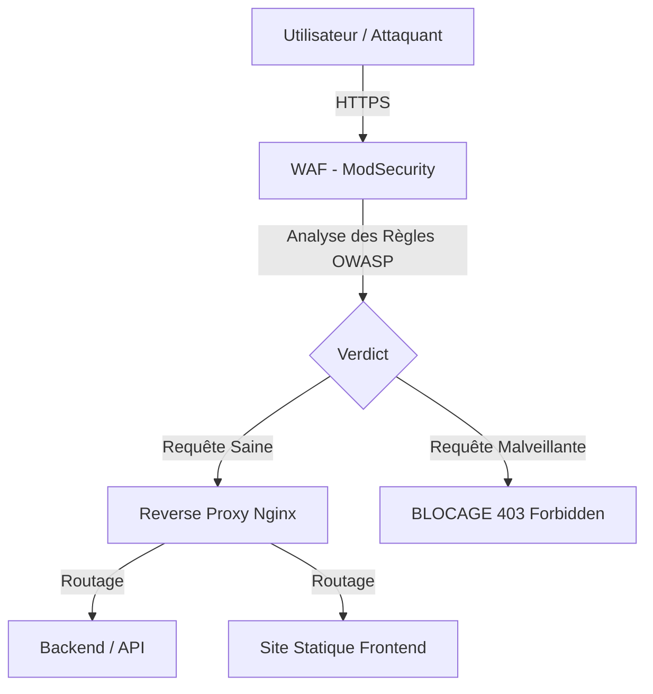

# 🛡️ Architecture & Rôle du WAF (ModSecurity)

Dans un projet "Hardened" comme **ft_transcendence**, le WAF (Web Application Firewall) est la première ligne de défense contre les attaques internet.

## 1. Pourquoi un WAF ?
Contrairement à un pare-feu classique qui bloque des ports, le WAF analyse le **contenu** des requêtes HTTP/HTTPS. Son but est d'identifier et de bloquer les comportements malveillants avant qu'ils n'atteignent votre code applicatif.

### Ce que le WAF bloque pour nous :
- **Injections SQL** : Tentatives de vol ou de suppression de la base de données.
- **XSS (Cross-Site Scripting)** : Injection de scripts malveillants pour voler les sessions utilisateurs.
- **LFI/RFI** : Tentatives de lecture de fichiers système sensibles (ex: /etc/passwd).
- **Brute Force** : Limitations sur les tentatives de connexion répétées.
- **Scanner de Vulnérabilités** : Blocage automatique des robots malveillants.

## 2. Notre Choix Technique : OWASP ModSecurity CRS
Nous utilisons l'image officielle **`owasp/modsecurity-crs`** basée sur Nginx et Alpine.

### Pourquoi ce choix ?
1. **Standard de l'Industrie** : L'OWASP Core Rule Set (CRS) est le jeu de règles le plus reconnu au monde.
2. **ModSecurity v3** : La version la plus moderne et performante du moteur de détection.
3. **Performance (Nginx/Alpine)** : Très léger et capable de gérer des milliers de requêtes par seconde avec une latence quasi nulle.

## 3. Schéma du Flux de Données

## 4. Mode de Fonctionnement
L'application est configurée en mode **`On`** (Active Blocking). Contrairement au mode passif (`DetectionOnly`), le WAF analyse et **bloque réellement** les requêtes malveillantes en renvoyant des codes d'erreur HTTP (403 Forbidden ou 404 Not Found pour les zones sensibles).

## 5. Conformité HTTPS & Certificats
Conformément aux exigences du projet, tout le trafic est chiffré.
*   **Protocole** : TLS 1.2 / 1.3.
*   **Certificats** : Pour le développement, nous utilisons des certificats **auto-signés** (générés via OpenSSL).
*   **Stockage** : Les fichiers `cert.pem` et `key.pem` sont montés dans le container ModSecurity. En production, ces secrets devront être injectés via **Vault**.

## 6. Stratégie de Test (Mock Backend)
Puisque l'application Kabaka.io est en cours de développement, nous validons l'architecture WAF en utilisant un **Mock Backend** (serveur Nginx léger). Cela permet de tester :
1.  La bonne redirection du trafic (Reverse Proxy).
2.  La validité des règles de blocage sans dépendre du code applicatif final.
3.  La performance du chiffrement HTTPS.

---
> [!IMPORTANT]
> Le WAF n'est pas "magique". Il doit être configuré avec précision pour éviter les **Faux Positifs** (quand une requête légitime est bloquée par erreur). Nous documenterons ces ajustements au fur et à mesure.
